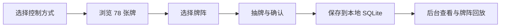

# Akashic Tarot

Akashic Tarot 是一个本地运行的 3D 塔罗交互应用：前端使用 Three.js 呈现卡牌舞台，MediaPipe Hands 支持摄像头手势，Python + SQLite 负责保存本地占卜记录。项目优先面向本地使用，不需要账号、不依赖云服务，也不需要前端构建步骤。


## 功能概览

- 78 张塔罗牌 3D 卡组，支持动态卡牌浏览与洗牌顺序。
- 鼠标模式和摄像头模式两套控制方式，摄像头模式可识别 OPEN、POINT、PINCH、FIST、TWO_FINGER 等手势。
- 支持三张牌、五张牌、凯尔特十字和自由牌阵。
- 每日一牌会按本地日期生成一条独立记录。
- 使用本地 SQLite 保存历史记录，后台页面可查看最近记录、回放牌阵并清空数据库。
- 支持黑夜/白天主题切换，主题偏好保存在浏览器本地。
- 包含前端交互、牌阵布局、手势识别、每日一牌和后端 API 测试。

## 界面示意



| 黑夜模式鼠标操作 | 摄像头模式等待态 | 后台记录页 |
| --- | --- | --- |
|  |  |  |

演示视频：[`docs/visuals/akashic-demo-dark.mp4`](docs/visuals/akashic-demo-dark.mp4)

## 快速开始

环境要求：

- Python 3.10 或更新版本
- 支持 WebGL 的现代浏览器
- 首次打开页面时需要联网加载 Three.js 和 MediaPipe CDN 脚本
- Node.js 仅用于运行 JavaScript 测试

启动本地服务：

```bash
python server.py
```

打开页面：

- 主应用：`http://localhost:8080/Three.html`
- 强制鼠标模式：`http://localhost:8080/Three.html?control=mouse`
- 强制摄像头模式：`http://localhost:8080/Three.html?control=camera`
- 后台记录页：`http://localhost:8080/admin.html`
- 健康检查：`http://localhost:8080/api/health`

如果需要保存历史记录，请通过 `python server.py` 启动服务后访问页面；直接双击 `Three.html` 只能运行静态页面，不能写入 SQLite。

## 操作说明

首次进入主应用时会选择控制方式，选择结果保存在浏览器 `localStorage` 中，也可以通过 URL 参数强制指定。

| 模式 | 操作 |
| --- | --- |
| 鼠标模式 | 移动鼠标指向卡牌，按住左键拾取/预览，松开开始或翻开；按 Space 确认；按 A/D 或左右方向键调整轮播方向。 |
| 摄像头模式 | 允许浏览器使用摄像头后，通过 OPEN、POINT、PINCH、FIST、TWO_FINGER 控制选牌、确认和继续。 |
| 主题切换 | 点击顶部主题按钮，或按键盘 `T` 在黑夜/白天主题之间切换。 |

常用手势：

| 手势 | 状态 | 行为 |
| --- | --- | --- |
| OPEN | 空闲 | 开始当前牌阵。 |
| POINT | 空闲 | 暂停轮播并高亮指向的牌。 |
| PINCH | 空闲或牌阵中 | 拾取并查看卡牌。 |
| FIST | 持牌时 | 确认当前卡牌并写入本次牌阵。 |
| TWO_FINGER | 空闲 | 左右滑动调整轮播速度或方向。 |
| OPEN / FIST | 牌阵完成提示 | OPEN 继续下一阵，FIST 结束并返回空闲状态。 |

## 本地数据与后台

后端会自动创建本地数据库：

```text
data/tarot.sqlite3
```

数据库包含两类核心数据：

- `readings`：每次牌阵或每日一牌的记录，包括类型、牌阵名称、日期和创建时间。
- `reading_cards`：每条记录中的卡牌，包括位置、位置含义、中文名、英文名、图片文件和正逆位。

后台页面 `admin.html` 可以查看最近记录、回放已保存牌阵，并提供清空数据库功能。清空操作需要输入 `CLEAR` 二次确认；该操作只影响本地 SQLite 文件。

## API

所有接口由 `server.py` 提供。

| 方法 | 路径 | 说明 |
| --- | --- | --- |
| `GET` | `/api/health` | 检查后端和数据库状态。 |
| `POST` | `/api/readings` | 保存一次完成的牌阵。 |
| `GET` | `/api/readings?limit=20` | 获取最近记录。 |
| `GET` | `/api/readings/{id}` | 获取单条记录和卡牌详情。 |
| `DELETE` | `/api/readings` | 清空本地记录并重置 id。 |
| `GET` | `/api/daily-draw?date=YYYY-MM-DD` | 获取指定日期的每日一牌。 |
| `POST` | `/api/daily-draw` | 创建或返回指定日期的每日一牌。 |

保存记录示例：

```json
{
  "kind": "spread",
  "templateKey": "three_timeline",
  "templateName": "三张牌 / Past Present Future",
  "readingDate": "2026-04-25",
  "spreadNumber": 1,
  "cards": [
    {
      "slot": 1,
      "slotLabel": "过去 / Past",
      "cardId": 0,
      "zh": "愚人",
      "en": "The Fool",
      "imageFile": "RWS_Tarot_00_Fool.jpg",
      "isReversed": false
    }
  ]
}
```

## 测试

运行 JavaScript 行为测试：

```bash
node tests/test_gesture.js
node tests/test_daily_draw.js
node tests/test_deck_order.js
node tests/test_input_mode.js
node tests/test_mouse_interaction.js
node tests/test_main_ui_state.js
node tests/test_spread_layout.js
node tests/test_spread_templates.js
node tests/test_reading_orientation.js
node tests/test_reading_replay.js
node tests/test_admin_helpers.js
```

检查 JavaScript 语法：

```powershell
Get-ChildItem js -Filter *.js | ForEach-Object { node --check $_.FullName }
```

运行后端测试：

```bash
python -m unittest tests.test_server -v
```

## 项目结构

```text
taluo/
├── Three.html          # 主应用
├── admin.html          # 本地历史记录后台
├── server.py           # 静态服务 + SQLite API
├── css/                # 主题、布局和响应式样式
├── js/                 # Three.js 场景、交互、手势、历史记录和后台逻辑
├── image2/             # 塔罗牌图片
├── docs/visuals/       # README 截图、概念图和演示视频
├── assets/textures/    # 本地纹理素材
└── tests/              # 前后端行为测试
```

## 开源说明

- 项目代码使用 MIT License，详见 [LICENSE](LICENSE)。
- `image2/` 中的卡牌图片用于本地演示，图片权利可能与项目代码许可证不同；再次分发前请确认对应素材授权。
- 摄像头手势需要浏览器摄像头权限。
- 默认页面会从公共 CDN 加载 Three.js 和 MediaPipe。
