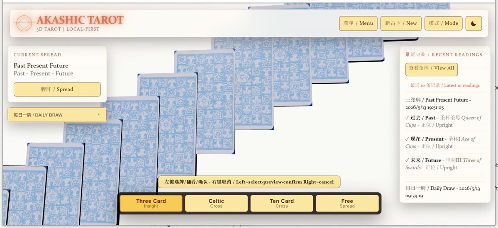
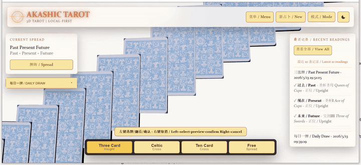
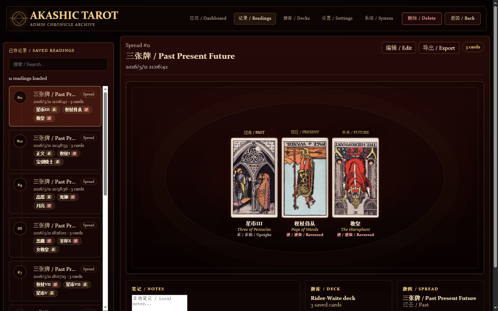
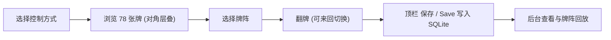

# Akashic Tarot

Akashic Tarot 是一个本地运行的 3D 塔罗交互应用：前端使用 Three.js 呈现卡牌舞台，MediaPipe Hands 支持摄像头手势，Python + SQLite 负责保存本地占卜记录。项目优先面向本地使用，不需要账号、不依赖云服务，也不需要前端构建步骤。


## 演示视频 / Demo

[](docs/demo/akashic-tour.mp4)

32 秒走完全部功能：闲置层叠 → POINT 悬停 → PINCH 拎起 → OPEN 发牌 → 翻 3 张 → 保存 → 黑白主题切换 → 回到空闲。点击上面海报打开完整 MP4，也可以看下面的 GIF 预览。



## 功能概览

- 78 张塔罗牌 3D 卡组，闲置态为 **unveil.fr 风格的对角层叠 (diagonal cascade)**：鼠标滚轮或 TWO_FINGER 手势驱动滚动，POINT 悬停将该牌前推放大。
- **每张面朝上的牌都有自己跟随的名称标签**——一次翻多张也都有标注。
- **自由翻牌切换**：点击面朝上的牌会把它翻回去，不会因为误点而毁掉一张牌；保存阵改成顶栏 **保存 / Save** 按钮，一键记录所有当前翻开的牌。
- **黑夜 / 白天双主题**：顶栏图标或键盘 `T` 切换；首次访问跟随 `prefers-color-scheme`，选择保存到 `localStorage("akashic-theme")`；主页面和 `admin.html` 共享主题。
- **白天模式卡背更鲜艳**：卡背材质在白天模式下被涂上冷白底色加皇家蓝自发光，读起来是真正的白蓝 Rider-Waite 花纹而非泛黄旧纸。
- 鼠标模式和摄像头模式两套控制方式，摄像头模式可识别 OPEN、POINT、PINCH、FIST、TWO_FINGER 等手势。
- 支持三张牌、五张牌、凯尔特十字和自由牌阵。
- 每日一牌会按本地日期生成一条独立记录。
- 使用本地 SQLite 保存历史记录，后台页面除了视觉牌阵回放，**每行记录都带卡名 + 正/逆位 chips**，每张回放卡下方还有 **卡名 + 正/逆位字幕**。
- "清空数据库" 操作需要输入 `CLEAR` 二次确认。
- 包含前端交互、牌阵布局、手势识别、每日一牌和后端 API 测试。

## 界面示意

| 黑夜模式鼠标操作 | 摄像头模式等待态 | 后台记录页 |
| --- | --- | --- |
|  |  |  |

灵感借自 [unveil.fr](https://unveil.fr/?ref=godly) 的灯光语言：扁平表面 + 四角晕染径向光 + 浮层 backdrop-blur + 品牌字标暖色 drop-shadow。深色主题保留烛光金色 (`#E3BF74`)，浅色主题切换到 unveil 暖琥珀 (`#D97757`)。



## 快速开始

环境要求：

- Python 3.10 或更新版本
- 支持 WebGL 的现代浏览器
- 首次打开页面时需要联网加载 Three.js 和 MediaPipe CDN 脚本
- Node.js 仅用于运行 JavaScript 测试

启动本地服务：

```bash
python server.py
```

打开页面：

- 主应用：`http://localhost:8080/Three.html`
- 强制鼠标模式：`http://localhost:8080/Three.html?control=mouse`
- 强制摄像头模式：`http://localhost:8080/Three.html?control=camera`
- 后台记录页：`http://localhost:8080/admin.html`
- 健康检查：`http://localhost:8080/api/health`

如果需要保存历史记录，请通过 `python server.py` 启动服务后访问页面；直接双击 `Three.html` 只能运行静态页面，不能写入 SQLite。

## 操作说明

首次进入主应用时会选择控制方式，选择结果保存在浏览器 `localStorage` 中，也可以通过 URL 参数强制指定。

| 模式 | 操作 |
| --- | --- |
| 鼠标模式 | 移动鼠标指向卡牌，左键点击翻看 / 再点击翻回，**鼠标滚轮**滚动层叠，右键收回所有预览，按顶栏 **保存 / Save** 写入牌阵。 |
| 摄像头模式 | 允许浏览器使用摄像头后，通过 OPEN、POINT、PINCH、FIST、TWO_FINGER 控制选牌、确认和继续。 |
| 主题切换 | 点击顶部主题按钮，或按键盘 `T` 在黑夜 / 白天主题之间切换；主页面和后台共享偏好。 |

常用手势：

| 手势 | 状态 | 行为 |
| --- | --- | --- |
| OPEN | 空闲 | 开始当前牌阵。 |
| POINT | 空闲 | 暂停层叠并把指向的牌向前突出。 |
| PINCH | 空闲 / 牌阵中 | 拾起并查看卡牌。 |
| FIST | 持牌时 | 确认当前卡牌并写入本次牌阵。 |
| TWO_FINGER | 空闲 | 左右滑动滚动对角层叠。 |
| OPEN / FIST | 牌阵完成提示 | OPEN 继续下一阵，FIST 结束并返回空闲状态。 |

## 主题与色板

| Token | 黑夜 / Dark | 白天 / Light |
| --- | --- | --- |
| `--surface` | `#0a0506` | `#fafaf7` |
| `--accent` | `#e3bf74`（烛光金） | `#d97757`（unveil 暖琥珀） |
| 动作按钮背景 | 深酒红泥色 | 鹅黄 `#fbe7a4` + 深琥珀描边 |

## 本地数据与后台

后端会自动创建本地数据库：

```text
data/tarot.sqlite3
```

数据库会保存以下核心数据：

- `readings`：每次牌阵或每日一牌的记录，包括类型、牌阵名称、日期和创建时间。
- `reading_cards`：每条记录中的卡牌，包括位置、位置含义、中文名、英文名、图片文件和正逆位。
- `consultations`：中文咨询问题、补充背景、输入来源和模块参数；与 reading 一对一。
- `interpretations`：每次模型生成的版本化解读及输入、RAG、Prompt 和 Agent 追踪快照。
- `interpretation_reviews`：人工结论、评分、问题标签、修订文本和隐私确认。
- `agent_steps`：一次 Agent 解读中的分类、检索、生成和审查轨迹。

后台页面 `admin.html` 可以查看最近记录、视觉回放已保存牌阵（每张回放卡下面带名字 + 正/逆字幕，列表每行带 chips），并提供清空数据库功能。清空操作需要输入 `CLEAR` 二次确认；该操作只影响本地 SQLite 文件。

## API

所有接口由 `server.py` 提供。

| 方法 | 路径 | 说明 |
| --- | --- | --- |
| `GET` | `/api/health` | 检查后端和数据库状态。 |
| `POST` | `/api/readings` | 保存一次完成的牌阵。 |
| `GET` | `/api/readings?limit=20` | 获取最近记录。 |
| `GET` | `/api/readings/{id}` | 获取单条记录和卡牌详情。 |
| `DELETE` | `/api/readings` | 清空本地记录并重置 id。 |
| `POST` | `/api/consultations` | 原子保存中文咨询、牌阵和手动录入的卡牌。 |
| `GET` | `/api/consultations?limit=20` | 获取最近咨询。 |
| `GET` | `/api/consultations/{id}` | 获取咨询、牌阵、全部解读版本和人工审核。 |
| `PUT` | `/api/interpretations/{id}/review` | 新增或更新某个解读版本的人工审核。 |
| `GET` | `/api/daily-draw?date=YYYY-MM-DD` | 获取指定日期的每日一牌。 |
| `POST` | `/api/daily-draw` | 创建或返回指定日期的每日一牌。 |

保存记录示例：

```json
{
  "kind": "spread",
  "templateKey": "three_timeline",
  "templateName": "三张牌 / Past Present Future",
  "readingDate": "2026-04-25",
  "spreadNumber": 1,
  "cards": [
    {
      "slot": 1,
      "slotLabel": "过去 / Past",
      "cardId": 0,
      "zh": "愚人",
      "en": "The Fool",
      "imageFile": "RWS_Tarot_00_Fool.jpg",
      "isReversed": false
    }
  ]
}
```

## AI 解读引擎 / Interpretation Engine

应用可以为任何已保存的牌阵生成 120-220 字的中文（或英文）专业风格解读。**全部本地推理，记录不离开你的机器。** 无需账号、无需上传隐私问题。

### 工作机制

```
admin/Three.html → POST /api/interpret/<reading_id>
                       │
                       │  策略：Ollama 优先；如检测不到本地服务且配了 OpenRouter key 则切云
                       ▼
                  Ollama (本地, qwen2.5:7b)
                       │
                       │  SSE 流式
                       ▼
                  写入 interpretations 表
                       +
                  实时推到 UI
```

- 三种解读风格：`traditional`（经典 Rider-Waite）/ `intuitive`（直觉派短诗）/ `psychological`（荣格原型视角）
- 双语：中 / 英
- 每次"重新生成"都新增一行历史记录，不覆盖
- Ollama 未启动时显示带可复制启动命令的提示横幅，应用其他功能不受影响

### 一次性安装（推荐用 D 盘部署，省 C 盘空间）

```powershell
# 1. 把模型存到 D 盘（必须先于安装设置）
New-Item -ItemType Directory -Path "D:\Ollama\models" -Force | Out-Null
[Environment]::SetEnvironmentVariable("OLLAMA_MODELS", "D:\Ollama\models", "User")
$env:OLLAMA_MODELS = "D:\Ollama\models"

# 2. 装 Ollama 到 D 盘（默认装 C，约 6.6GB；用 /DIR= 强制改到 D）
# 下载安装器：
Invoke-WebRequest "https://ollama.com/download/OllamaSetup.exe" -OutFile "D:\Programs\OllamaSetup.exe"
Start-Process "D:\Programs\OllamaSetup.exe" -ArgumentList "/DIR=D:\Programs\Ollama","/SILENT","/NORESTART" -Wait

# 3. 启动服务（在 D 盘里发现模型目录）
& "D:\Programs\Ollama\ollama.exe" serve   # 单独终端跑着

# 4. 拉默认模型（~4.5GB 下载到 D:）
& "D:\Programs\Ollama\ollama.exe" pull qwen2.5:7b
```

### 模型选型

| 显存 / GPU | 推荐 | 大概速度 | 拉取命令 |
|---|---|---|---|
| 6GB（笔记本 RTX 3060 类） | **qwen2.5:7b** ⭐ | 15-25 tok/s · 30s 一次 | `ollama pull qwen2.5:7b` |
| 12GB+ | qwen2.5:14b | 5-10 tok/s · 60s 一次 | `ollama pull qwen2.5:14b` |
| 纯 CPU 16GB RAM | qwen2.5:7b | 4-6 tok/s · 90s 一次 | 同上 |
| 想要 72B 顶级输出 | 用 OpenRouter 云回退 | ~$0.0002 / 次 | 见下 |

在 Admin → Settings 页面可以切换 `ollama_model`，例如改成 `qwen2.5:14b`。

### 云端回退（可选）

如果本地机器跑不动或者想要更高质量，可以配 OpenRouter 作为后备：

1. 注册 [https://openrouter.ai/](https://openrouter.ai/) 拿一个 `sk-or-…` key
2. 打开 `admin.html` → Settings → AI 解读引擎卡片
3. 粘贴 key 到 **OpenRouter API Key**，保存
4. 后端选 `openrouter`，模型选 `qwen/qwen-2.5-72b-instruct`（或其他）

策略：选 `ollama` 时若 Ollama 检测不到，且 key 已配 → 自动切云。Key 仅存于本地 SQLite，不上传，UI 永不返回明文。

### 不上传任何数据

- Ollama 通信全部在 `localhost:11434`
- API key 存在 `data/tarot.sqlite3` 的 `interpret_settings` 表，永不离开本机
- OpenRouter 回退**仅在你配 key 且本地 Ollama 不可用时**才会使用
- 解读历史存在 `interpretations` 表（`reading_id` 外键到 `readings`），删除 reading 会级联删除其解读

### 自检 / 调试

```bash
# Ollama 健康检查（包含模型是否拉取）
curl http://localhost:8080/api/interpret/health

# 流式生成测试（假设有 reading_id=1）
curl -N -X POST -H "Content-Type: application/json" \
  --data-binary '{"style":"traditional","language":"zh"}' \
  http://localhost:8080/api/interpret/1

# 查看历史
curl "http://localhost:8080/api/interpret/1?all=1"

# 改配置
curl -X POST -H "Content-Type: application/json" \
  --data-binary '{"ollama_model":"qwen2.5:14b"}' \
  http://localhost:8080/api/interpret/settings
```

### 中文咨询数据接口

手动录牌使用独立的咨询记录保存问题、背景和输入来源。创建操作会在一个 SQLite 事务中同时写入 reading、cards 和 consultation；任一步校验或写入失败都会整体回滚。

```json
POST /api/consultations
{
  "language": "zh",
  "moduleType": "general_reading",
  "inputMode": "manual",
  "userQuery": "我应该如何看待这次工作机会？",
  "userContext": "目前稳定，但成长空间有限。",
  "modulePayload": {},
  "templateKey": "three_timeline",
  "templateName": "三张牌时间线",
  "cards": [
    {
      "slot": 1,
      "slotLabel": "过去",
      "cardId": 9,
      "zh": "隐者",
      "en": "The Hermit",
      "imageFile": "RWS_Tarot_09_Hermit.jpg",
      "isReversed": false
    },
    {
      "slot": 2,
      "slotLabel": "现在",
      "cardId": 10,
      "zh": "命运之轮",
      "en": "Wheel of Fortune",
      "imageFile": "RWS_Tarot_10_Wheel_of_Fortune.jpg",
      "isReversed": false
    },
    {
      "slot": 3,
      "slotLabel": "未来",
      "cardId": 8,
      "zh": "力量",
      "en": "Strength",
      "imageFile": "RWS_Tarot_08_Strength.jpg",
      "isReversed": false
    }
  ]
}
```

- `GET /api/consultations?limit=20`：列出最近咨询，可用 `module_type` 筛选。
- `GET /api/consultations/<id>`：返回问题、牌阵、全部解读版本及人工审核。
- `POST /api/interpret/<readingId>`：使用已保存的问题和背景进行 SSE 流式解读；不能用请求参数覆盖已保存问题。
- `PUT /api/interpretations/<id>/review`：保存 `accepted`、`needs_work`、`rejected` 或 `edited` 审核。

模型生成文本默认不是训练数据。只有人工结论为 `accepted` 或 `edited`、确认本地隐私状态且通过后续安全过滤的版本，才具备导出候选资格。

### 范围限制

当前阶段仍**不**包含：多轮对话追问、跨记录 RAG、用户自定义 prompt、数据集导出和模型微调。这些是后续迭代项；本阶段只建立可追溯、可人工审核的数据基础。

## Agent 系统 / Agent System

Phase 2 在上面 Interpretation Engine 之上叠了一个**带检索增强与自我审查的小型 Agent 管道**。当用户在解读时附带具体问题（如 "我应该跳槽吗？"），系统会完整跑完 **classify → retrieve → generate → critique** 四步，并把每一步持久化进 `agent_steps` 表。没有问题时直接走快路径 (`retrieve → generate`)，没有任何额外延迟。

完整设计、API、失败模式与性能数字见 [`ARCHITECTURE.md`](ARCHITECTURE.md)。

### 关键能力

- **结构化分类器**：JSON-mode Ollama 调用，闭集词汇约束（`topic ∈ {career, relationship, health, growth, general}`），多层容错解析，单次调用失败不阻塞主流程。
- **向量 RAG**：156 条中英双语领域语料，`nomic-embed-text` 768 维，SQLite float32 BLOB 存储，幂等构建（`corpus_signature` 短路）。两阶段过滤：确定性 card_id 匹配 → question 余弦重排。
- **流式生成 + 后置审查**：generate 走 SSE 流式直接给到用户（首 token < 1s），critique 在 `finally` 里跑，结果只入库不返流 — **审查不影响用户感知延迟**。
- **完整 trace**：每次运行一个 `trace_id`，4 步全量记录（输入摘要 / 完整 JSON 输出 / 模型 / 耗时 / 成功标志），可按 `/api/interpret/<id>/agent-trace` 端点查看。
- **优雅降级**：embedder 不可达时自动 fall back 到 canonical lookup；classifier 失败时使用安全默认值；critic 在 OpenRouter 后端下跳过避免双倍云端开销。

### 端点

| Method | Path | 用途 |
|---|---|---|
| POST | `/api/interpret/<id>` | SSE 流式，body 加 `question` 触发 Agent 模式 |
| GET | `/api/interpret/<id>/agent-trace` | 该 reading 最近一次 trace |
| GET | `/api/interpret/rag-status` | 嵌入索引状态 |
| POST | `/api/interpret/rag-build` | 触发 / 刷新索引（幂等） |

### 可视化

浏览器打开 `http://localhost:8080/telemetry.html?rid=<reading_id>` 查看任一 reading 的 Agent 推理时间线 — 4 步颜色分类、耗时占比条、完整输入 / 输出 JSON。

### 评测 / Evals

```bash
# 30 题 golden set，本地 critique 打分，跑完写 docs/evals/eval-*.md
python -m evals

# 启用 OpenRouter 72B 作为独立第三方 LM-judge
python -m evals --judge

# 快速 smoke
python -m evals --limit 3
```

评测覆盖：分类器 topic 准确率、本地 critique 平均分（/10）、LM-judge 5 轴打分（relevance / card_grounding / coherence / specificity / style_match）、各步骤耗时、每条样本回看。报告写入 `docs/evals/`。

**最近一次 30 题全量评测**（`qwen2.5:7b` + RTX 3060 6GB，traditional 风格，中文）：

| 指标 | 值 |
|---|---|
| 分类器 topic 准确率 | **90.0%** (27/30) |
| 本地 critique 平均分 (/10) | **8.17** |
| 单题平均总耗时 | 26.8 s |
| 其中 generate 流式（首 token < 1s） | 11.7 s |
| classify | 4.6 s |
| critique（后置，用户不感知） | 6.3 s |
| 错误数 | 0 / 30 |

各 topic 分项准确率：`relationship 100%`、`growth 100%`、`general 100%`、`career 83.3%`、`health 66.7%`。完整报告：[`docs/evals/eval-20260524T082210Z.md`](docs/evals/eval-20260524T082210Z.md)。

## 测试

运行 JavaScript 行为测试：

```bash
node tests/test_mouse_interaction.js
node tests/test_main_ui_state.js
node tests/test_spread_layout.js
node tests/test_spread_templates.js
node tests/test_reading_replay.js
node tests/test_admin_helpers.js
node tests/test_deck_order.js
node tests/test_daily_draw.js
node tests/test_input_mode.js
node tests/test_reading_orientation.js
node tests/test_interpret.js      # AI 解读 SSE 解析 + 错误态
```

运行 Python 测试：

```bash
python -m unittest tests.test_server -v
python -m unittest tests.test_interpret_service -v  # 25 个解读 service 测试
```

检查 JavaScript 语法：

```powershell
Get-ChildItem js -Filter *.js | ForEach-Object { node --check $_.FullName }
```


## 项目结构

```text
taluo/
├── Three.html          # 主应用
├── admin.html          # 本地历史记录后台
├── server.py           # 静态服务 + SQLite API + 解读流式端点
├── interpret_prompts.py  # 系统 prompt + 风格 overlay + slop 正则
├── interpret_service.py  # Ollama / OpenRouter 客户端 + 策略 + 持久化
├── css/
│   ├── tokens.css      # CSS 变量（按 [data-theme] 分组）
│   ├── base.css        # html / body 基础样式
│   ├── components.css  # 通用组件：顶栏、按钮、面板
│   ├── theme.css       # 四角晕染、雾效层和白天模式样式覆盖
│   ├── tarot.css       # 主页面专属
│   ├── admin.css       # 后台页专属
│   ├── interpret.css   # AI 解读面板 / 弹窗 / 错误横幅
│   └── responsive.css  # 响应式补丁
├── assets/textures/    # 本地纹理素材
├── data/.gitkeep       # 运行时 SQLite 数据库目录
├── docs/
│   ├── demo/           # 32s 演示 MP4 + GIF + 海报
│   └── visuals/        # 截图和概念图
├── image2/             # 卡背 + 78 张塔罗牌图
├── js/
│   ├── api.js          # API 客户端，含离线降级
│   ├── admin.js        # 后台 UI（行内 chips + 回放字幕）
│   ├── carousel.js     # 对角层叠卡组（unveil.fr 风格）
│   ├── daily_draw.js   # 每日一牌
│   ├── deck.js         # 卡牌定义
│   ├── deck_order.js   # 闲置态洗牌
│   ├── gesture.js      # 手势分类与稳定化
│   ├── history.js      # 历史记录捕获与渲染
│   ├── input_mode.js   # 摄像头 / 鼠标模式选择
│   ├── main.js         # Three.js 场景、按主题调灯、滚轮处理
│   ├── main_ui_state.js # 顶栏主按钮状态机
│   ├── mediapipe.js    # MediaPipe 摄像头集成
│   ├── mouse_interaction.js # 点击翻 / 翻回的解析器
│   ├── particles.js    # 灰烬粒子效果
│   ├── reading_replay.js # 后台牌阵回放
│   ├── spread.js       # 牌阵状态机与交互
│   ├── spread_flow.js  # 牌阵流程小型纯函数
│   ├── spread_layout.js # 响应式牌阵布局
│   ├── spread_templates.js # 牌阵模板定义
│   ├── state.js        # 共享运行时状态
│   ├── theme.js        # 黑白主题控制 + 持久化
│   ├── interpret.js    # AI 解读 SSE 消费 + mountPanel + 错误态
│   ├── ui.js           # 每张卡的浮动标签池
│   └── utils.js        # 纹理与清理工具
└── tests/              # 前后端行为测试
```

## 开源说明

- 项目代码使用 MIT License，详见 [LICENSE](LICENSE)。
- `image2/` 中的卡牌图片用于本地演示，图片权利可能与项目代码许可证不同；再次分发前请确认对应素材授权。
- 摄像头手势需要浏览器摄像头权限。
- 默认页面会从公共 CDN 加载 Three.js 和 MediaPipe。
